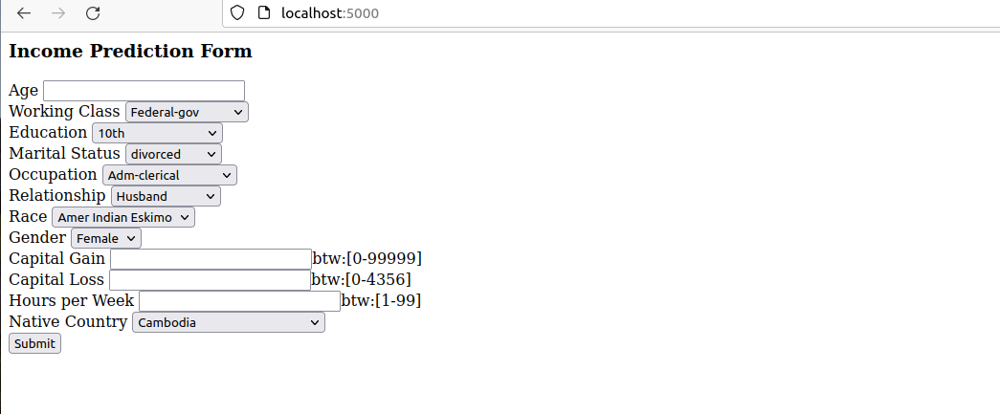

# basic_ml_flask_docker_tutorial

This tutorial is how to run a very basic ML model prediction using flask web-framework inside a docker container


Since this code is more about how to run the ML prediction code inside a docker container, I took an existing ML model code: https://github.com/hoshangk/machine_learning_model_using_flask_web_framework. This was done purposely to keep the ML modelling + flask app building part(as I already covered them in previous tutorial) abstracted out and treat them as a blackbox provided by some other team.

I did re-structure and edit some of the code for better file organization for this tutorial.

## Lets focus on the docker related files of interest here

1. open ```dockerfile``` : This is the script to build docker image

    FROM: A Dockerfile must begin with a FROM instruction. The FROM instruction specifies the Parent Image from which you are building. In our case we took ubuntu base image. 
    
    RUN executes the command. 

    WORKDIR: The WORKDIR instruction sets the working directory for any RUN, CMD, ENTRYPOINT, COPY and ADD instructions that follow it in the Dockerfile. 
    There when we call COPY in the later lines, it knows the src path, where to copy from. 

    COPY . .  Means copy everthing in src current folder, to the destinations current path

Best documentation to undeerstand more options : https://docs.docker.com/engine/reference/

2. check ```requirements.txt``` This is where we tell what exact dependencies the image should have. The whole purpose of docker is to pass over dependencies like these in isolated container environnment so that it can be run on any machine without creating any conflicts on the destination system machines preinstalled dependencies or other applications and/or containers.
3. check ```.dockerignore``` : This is the file to put files/folders eg. log files to ignore while building docker image. In our case we want to skip the salary_dataset we used to create the model. Since we are already passing the model, and we are using the model directly in the web application ```app.py```, we can skip put the dataset which can make the image heavy.

## Build the image
```
docker build  --no-cache --tag ml-flask-docker-3 .
```

## Run the container
```
docker run -d -p 5000:5000 ml-flask-docker-3
```

## Check the container app running on web-browser


